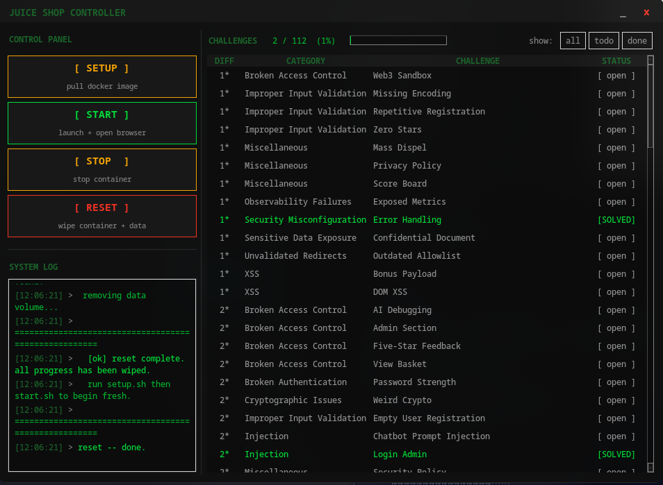

# juicer
Docker manager and vuln tracker for OWASP Juice Shop.



> couldn't be more simple

## Features
- Setup, start, stop and reset the Juice Shop Docker container
- Live challenge tracker via the Juice Shop API
- Cross-platform (Windows + Linux)

## Usage
```bash
python juiceshop_gui.py
```

## Requirements
- Python 3.x
- Docker
- tkinter

---
*made during internship*
